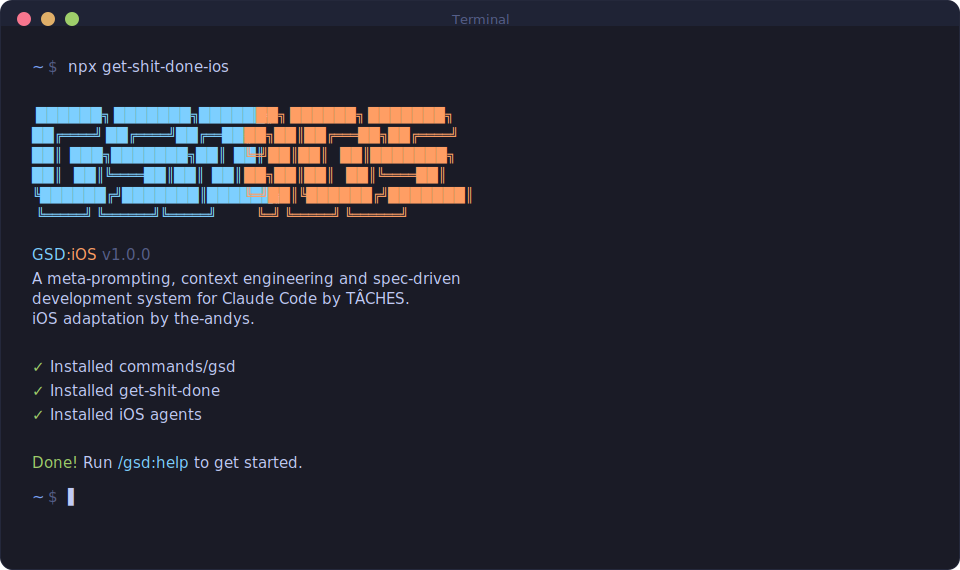

<div align="center">

# GET SHIT DONE — iOS Edition

**A meta-prompting, context engineering, and spec-driven development system for building native iOS apps with Claude Code.**

**Optimized for Swift, SwiftUI, SwiftData, and MVVM.**

**Solves context rot — the quality degradation that happens as Claude fills its context window.**

[](LICENSE)
[](https://github.com/glittercowboy/get-shit-done)

```bash
npx get-shit-done-ios@latest
```

**Requires macOS and Xcode.**

<br>

> **Built on [Get Shit Done](https://github.com/glittercowboy/get-shit-done) by TÂCHES.**
> This is an iOS-native fork — all agents, references, templates, and workflows
> have been adapted for Swift, SwiftUI, and native iOS development patterns.

<br>

*"If you know clearly what you want, this WILL build it for you. No bs."*

*"I've done SpecKit, OpenSpec and Taskmaster — this has produced the best results for me."*

*"By far the most powerful addition to my Claude Code. Nothing over-engineered. Literally just gets shit done."*

<br>

**Built on the GSD framework, trusted by engineers at Amazon, Google, Shopify, and Webflow.**



[Why This Fork Exists](#why-this-fork-exists) · [How It Works](#how-it-works) · [Commands](#commands) · [Why It Works](#why-it-works) · [User Guide](docs/USER-GUIDE.md)

</div>

---

## Why This Fork Exists

GSD is an incredible system for building software with Claude Code. But its agents, examples, and references assume web development — React components, API routes, npm packages, TypeScript patterns.

If you're building native iOS apps, that context mismatch matters. Claude works best when every reference it sees matches the world it's building in. An executor told to "create a component in `src/`" when you need a SwiftUI View in `Sources/Views/` is wasted context at best, hallucinated code at worst.

This fork adapts every layer of GSD for native iOS development:

- **Agents** — Executor, planner, verifier, roadmapper all speak Swift, SwiftUI, and MVVM
- **References** — iOS guidelines for Swift style, frameworks, testing, permissions, and app lifecycle
- **Templates** — File paths use `Sources/`, verification checks SwiftUI wiring and `@Observable` state
- **Accessibility built-in** — VoiceOver labels, Dynamic Type, and WCAG AA are part of every phase, not afterthoughts
- **Localization enforced** — No hardcoded user-facing strings, `String(localized:)` from day one

The framework logic is identical to upstream GSD. The context is native iOS.

---

Vibecoding has a bad reputation. You describe what you want, AI generates code, and you get inconsistent garbage that falls apart at scale.

GSD fixes that. It's the context engineering layer that makes Claude Code reliable. Describe your app idea, let the system extract everything it needs to know, and let Claude Code build it with proper SwiftUI architecture, accessibility, and native patterns.

---

## Who This Is For

iOS developers who want to describe their app idea and have it built correctly — with proper SwiftUI architecture, accessibility, native patterns, and clean Swift — without pretending they're running a 50-person engineering org.

---

## Getting Started

```bash
npx get-shit-done-ios@latest
```

The installer prompts you to choose:
1. **Location** — Global (all projects) or local (current iOS project only)

Verify with `/gsd:help` inside Claude Code.

> **Requires:** macOS, Xcode, Node.js 18+, Claude Code.

### Staying Updated

```bash
npx get-shit-done-ios@latest
```

Or use `/gsd:update` inside Claude Code for changelog preview before updating.

<details>
<summary><strong>Non-Interactive Install (CI, Scripts)</strong></summary>

```bash
npx get-shit-done-ios --claude --local    # Install to ./.claude/ (current project)
npx get-shit-done-ios --claude --global   # Install to ~/.claude/ (all projects)
```

Use `--global` (`-g`) or `--local` (`-l`) to skip the location prompt.

</details>

<details>
<summary><strong>Development Installation</strong></summary>

Clone the repository and run the installer locally:

```bash
git clone https://github.com/the-andys/get-shit-done-ios.git
cd get-shit-done-ios
node bin/install.js --claude --local
```

Installs to `./.claude/` for testing modifications before contributing.

</details>

### Recommended: Skip Permissions Mode

GSD is designed for frictionless automation. Run Claude Code with:

```bash
claude --dangerously-skip-permissions
```

> [!TIP]
> This is how GSD is intended to be used — stopping to approve `date` and `git commit` 50 times defeats the purpose.

<details>
<summary><strong>Alternative: Granular Permissions</strong></summary>

If you prefer not to use that flag, add this to your project's `.claude/settings.json`:

```json
{
  "permissions": {
    "allow": [
      "Bash(date:*)",
      "Bash(echo:*)",
      "Bash(cat:*)",
      "Bash(ls:*)",
      "Bash(mkdir:*)",
      "Bash(wc:*)",
      "Bash(head:*)",
      "Bash(tail:*)",
      "Bash(sort:*)",
      "Bash(grep:*)",
      "Bash(tr:*)",
      "Bash(git add:*)",
      "Bash(git commit:*)",
      "Bash(git status:*)",
      "Bash(git log:*)",
      "Bash(git diff:*)",
      "Bash(git tag:*)"
    ]
  }
}
```

</details>

### Using Alongside GSD (Web)

If you already use the original GSD for web development, GSD:iOS works side by side without conflicts. Claude Code resolves commands by priority: **local commands shadow global ones with the same name.**

The recommended setup:

| Your setup | Web projects | iOS projects |
|---|---|---|
| GSD Web global + GSD:iOS local | Global commands apply | Local iOS commands take priority |
| GSD:iOS global + GSD Web local | Global iOS commands apply | Local web commands take priority |

When both are installed, you won't see duplicate commands — the local version always wins. Agents, references, and templates follow the same resolution order.

In practice: install whichever you use most as `--global`, and the other as `--local` in the relevant projects.

---


## How It Works

> **Already have code?** Run `/gsd:map-codebase` first. It spawns parallel agents to analyze your stack, architecture, conventions, and concerns. Then `/gsd:new-project` knows your codebase — questions focus on what you're adding, and planning automatically loads your patterns.

### 1. Initialize Project

```
/gsd:new-project
```

One command, one flow. The system:

1. **Questions** — Asks until it understands your app completely (goals, constraints, tech preferences, edge cases)
2. **Research** — Spawns parallel agents to investigate the domain (optional but recommended)
3. **Requirements** — Extracts what's v1, v2, and out of scope
4. **Roadmap** — Creates phases mapped to requirements

You approve the roadmap. Now you're ready to build.

**Creates:** `PROJECT.md`, `REQUIREMENTS.md`, `ROADMAP.md`, `STATE.md`, `.planning/research/`

---

### 2. Discuss Phase

```
/gsd:discuss-phase 1
```

**This is where you shape the implementation.**

Your roadmap has a sentence or two per phase. That's not enough context to build something the way *you* imagine it. This step captures your preferences before anything gets researched or planned.

The system analyzes the phase and identifies gray areas based on what's being built:

- **Visual features** → Layout, density, interactions, empty states
- **APIs/CLIs** → Response format, flags, error handling, verbosity
- **Content systems** → Structure, tone, depth, flow
- **Organization tasks** → Grouping criteria, naming, duplicates, exceptions

For each area you select, it asks until you're satisfied. The output — `CONTEXT.md` — feeds directly into the next two steps:

1. **Researcher reads it** — Knows what patterns to investigate ("user wants card layout" → research SwiftUI card patterns and LazyVGrid)
2. **Planner reads it** — Knows what decisions are locked ("tab navigation decided" → plan includes TabView with NavigationStack per tab)

The deeper you go here, the more the system builds what you actually want. Skip it and you get reasonable defaults. Use it and you get *your* vision.

**Creates:** `{phase_num}-CONTEXT.md`

---

### 3. Plan Phase

```
/gsd:plan-phase 1
```

The system:

1. **Researches** — Investigates how to implement this phase, guided by your CONTEXT.md decisions
2. **Plans** — Creates 2-3 atomic task plans with XML structure
3. **Verifies** — Checks plans against requirements, loops until they pass

Each plan is small enough to execute in a fresh context window. No degradation, no "I'll be more concise now."

**Creates:** `{phase_num}-RESEARCH.md`, `{phase_num}-{N}-PLAN.md`

---

### 4. Execute Phase

```
/gsd:execute-phase 1
```

The system:

1. **Runs plans in waves** — Parallel where possible, sequential when dependent
2. **Fresh context per plan** — 200k tokens purely for implementation, zero accumulated garbage
3. **Commits per task** — Every task gets its own atomic commit
4. **Verifies against goals** — Checks the codebase delivers what the phase promised

Walk away, come back to completed work with clean git history.

**How Wave Execution Works:**

Plans are grouped into "waves" based on dependencies. Within each wave, plans run in parallel. Waves run sequentially.

```
┌─────────────────────────────────────────────────────────────────────┐
│  PHASE EXECUTION                                                     │
├─────────────────────────────────────────────────────────────────────┤
│                                                                      │
│  WAVE 1 (parallel)          WAVE 2 (parallel)          WAVE 3       │
│  ┌─────────┐ ┌─────────┐    ┌─────────┐ ┌─────────┐    ┌─────────┐ │
│  │ Plan 01 │ │ Plan 02 │ →  │ Plan 03 │ │ Plan 04 │ →  │ Plan 05 │ │
│  │         │ │         │    │         │ │         │    │         │ │
│  │ User    │ │ Product │    │ Orders  │ │ Cart    │    │ Checkout│ │
│  │ Model   │ │ Model   │    │ API     │ │ API     │    │ UI      │ │
│  └─────────┘ └─────────┘    └─────────┘ └─────────┘    └─────────┘ │
│       │           │              ↑           ↑              ↑       │
│       └───────────┴──────────────┴───────────┘              │       │
│              Dependencies: Plan 03 needs Plan 01            │       │
│                          Plan 04 needs Plan 02              │       │
│                          Plan 05 needs Plans 03 + 04        │       │
│                                                                      │
└─────────────────────────────────────────────────────────────────────┘
```

**Why waves matter:**
- Independent plans → Same wave → Run in parallel
- Dependent plans → Later wave → Wait for dependencies
- File conflicts → Sequential plans or same plan

This is why "vertical slices" (Plan 01: User feature end-to-end) parallelize better than "horizontal layers" (Plan 01: All models, Plan 02: All APIs).

**Creates:** `{phase_num}-{N}-SUMMARY.md`, `{phase_num}-VERIFICATION.md`

---

### 5. Verify Work

```
/gsd:verify-work 1
```

**This is where you confirm it actually works.**

Automated verification checks that code exists and tests pass. But does the feature *work* the way you expected? This is your chance to run it in the Simulator, test VoiceOver navigation, and try different Dynamic Type sizes.

The system:

1. **Extracts testable deliverables** — What you should be able to do now
2. **Walks you through one at a time** — "Can you log in with email?" Yes/no, or describe what's wrong
3. **Diagnoses failures automatically** — Spawns debug agents to find root causes
4. **Creates verified fix plans** — Ready for immediate re-execution

If everything passes, you move on. If something's broken, you don't manually debug — you just run `/gsd:execute-phase` again with the fix plans it created.

**Creates:** `{phase_num}-UAT.md`, fix plans if issues found

---

### 6. Repeat → Complete → Next Milestone

```
/gsd:discuss-phase 2
/gsd:plan-phase 2
/gsd:execute-phase 2
/gsd:verify-work 2
...
/gsd:complete-milestone
/gsd:new-milestone
```

Loop **discuss → plan → execute → verify** until milestone complete.

Each phase gets your input (discuss), proper research (plan), clean execution (execute), and human verification (verify). Context stays fresh. Quality stays high.

When all phases are done, `/gsd:complete-milestone` archives the milestone and tags the release.

Then `/gsd:new-milestone` starts the next version — same flow as `new-project` but for your existing codebase. You describe what you want to build next, the system researches the domain, you scope requirements, and it creates a fresh roadmap. Each milestone is a clean cycle: define → build → ship.

---

### Quick Mode

```
/gsd:quick
```

**For ad-hoc tasks that don't need full planning.**

Quick mode gives you GSD guarantees (atomic commits, state tracking) with a faster path:

- **Same agents** — Planner + executor, same quality
- **Skips optional steps** — No research, no plan checker, no verifier
- **Separate tracking** — Lives in `.planning/quick/`, not phases

Use for: bug fixes, small features, config changes, one-off tasks.

```
/gsd:quick
> What do you want to do? "Add haptic feedback to the save button"
```

**Creates:** `.planning/quick/001-add-haptic-feedback/PLAN.md`, `SUMMARY.md`

---

## Why It Works

### Context Engineering

Claude Code is incredibly powerful *if* you give it the context it needs. Most people don't.

GSD handles it for you:

| File | What it does |
|------|--------------|
| `PROJECT.md` | Project vision, always loaded |
| `research/` | Ecosystem knowledge (stack, features, architecture, pitfalls) |
| `REQUIREMENTS.md` | Scoped v1/v2 requirements with phase traceability |
| `ROADMAP.md` | Where you're going, what's done |
| `STATE.md` | Decisions, blockers, position — memory across sessions |
| `PLAN.md` | Atomic task with XML structure, verification steps |
| `SUMMARY.md` | What happened, what changed, committed to history |
| `todos/` | Captured ideas and tasks for later work |

Size limits based on where Claude's quality degrades. Stay under, get consistent excellence.

### XML Prompt Formatting

Every plan is structured XML optimized for Claude:

```xml
<task type="auto">
  <n>Create authentication service</n>
  <files>Sources/Features/Auth/AuthService.swift</files>
  <action>
    Use URLSession with async/await for authentication.
    Validate credentials against the server.
    Store token securely in Keychain.
    Mark class with @MainActor for UI-safe state updates.
  </action>
  <verify>
    xcodebuild test -scheme MyApp -destination 'platform=iOS Simulator,name=iPhone 16'
    -only-testing:MyAppTests/AuthServiceTests
  </verify>
  <done>Valid credentials return token stored in Keychain, invalid throw AuthError.unauthorized</done>
</task>
```

Precise instructions. No guessing. Verification built in.

### Multi-Agent Orchestration

Every stage uses the same pattern: a thin orchestrator spawns specialized agents, collects results, and routes to the next step.

| Stage | Orchestrator does | Agents do |
|-------|------------------|-----------|
| Research | Coordinates, presents findings | 4 parallel researchers investigate stack, features, architecture, pitfalls |
| Planning | Validates, manages iteration | Planner creates plans, checker verifies, loop until pass |
| Execution | Groups into waves, tracks progress | Executors implement in parallel, each with fresh 200k context |
| Verification | Presents results, routes next | Verifier checks codebase against goals, debuggers diagnose failures |

The orchestrator never does heavy lifting. It spawns agents, waits, integrates results.

**The result:** You can run an entire phase — deep research, multiple plans created and verified, thousands of lines of code written across parallel executors, automated verification against goals — and your main context window stays at 30-40%. The work happens in fresh subagent contexts. Your session stays fast and responsive.

### Atomic Git Commits

Each task gets its own commit immediately after completion:

```bash
abc123f docs(08-02): complete user registration plan
def456g feat(08-02): add email confirmation flow
hij789k feat(08-02): implement password hashing
lmn012o feat(08-02): create registration endpoint
```

> [!NOTE]
> **Benefits:** Git bisect finds exact failing task. Each task independently revertable. Clear history for Claude in future sessions. Better observability in AI-automated workflow.

Every commit is surgical, traceable, and meaningful.

### Modular by Design

- Add phases to current milestone
- Insert urgent work between phases
- Complete milestones and start fresh
- Adjust plans without rebuilding everything

You're never locked in. The system adapts.

---

## Commands

### Core Workflow

| Command | What it does |
|---------|--------------|
| `/gsd:new-project [--auto]` | Full initialization: questions → research → requirements → roadmap |
| `/gsd:discuss-phase [N] [--auto]` | Capture implementation decisions before planning |
| `/gsd:plan-phase [N] [--auto]` | Research + plan + verify for a phase |
| `/gsd:execute-phase <N>` | Execute all plans in parallel waves, verify when complete |
| `/gsd:verify-work [N]` | Manual user acceptance testing ¹ |
| `/gsd:audit-milestone` | Verify milestone achieved its definition of done |
| `/gsd:complete-milestone` | Archive milestone, tag release |
| `/gsd:new-milestone [name]` | Start next version: questions → research → requirements → roadmap |

### Navigation

| Command | What it does |
|---------|--------------|
| `/gsd:progress` | Where am I? What's next? |
| `/gsd:help` | Show all commands and usage guide |
| `/gsd:update` | Update GSD with changelog preview |

### Brownfield

| Command | What it does |
|---------|--------------|
| `/gsd:map-codebase` | Analyze existing codebase before new-project |

### Phase Management

| Command | What it does |
|---------|--------------|
| `/gsd:add-phase` | Append phase to roadmap |
| `/gsd:insert-phase [N]` | Insert urgent work between phases |
| `/gsd:remove-phase [N]` | Remove future phase, renumber |
| `/gsd:list-phase-assumptions [N]` | See Claude's intended approach before planning |
| `/gsd:plan-milestone-gaps` | Create phases to close gaps from audit |

### Session

| Command | What it does |
|---------|--------------|
| `/gsd:pause-work` | Create handoff when stopping mid-phase |
| `/gsd:resume-work` | Restore from last session |

### Utilities

| Command | What it does |
|---------|--------------|
| `/gsd:settings` | Configure model profile and workflow agents |
| `/gsd:set-profile <profile>` | Switch model profile (quality/balanced/budget) |
| `/gsd:add-todo [desc]` | Capture idea for later |
| `/gsd:check-todos` | List pending todos |
| `/gsd:debug [desc]` | Systematic debugging with persistent state |
| `/gsd:quick [--full]` | Execute ad-hoc task with GSD guarantees (`--full` adds plan-checking and verification) |
| `/gsd:health [--repair]` | Validate `.planning/` directory integrity, auto-repair with `--repair` |

<sup>¹ Contributed by reddit user OracleGreyBeard</sup>

---

## Configuration

GSD stores project settings in `.planning/config.json`. Configure during `/gsd:new-project` or update later with `/gsd:settings`. For the full config schema, workflow toggles, git branching options, and per-agent model breakdown, see the [User Guide](docs/USER-GUIDE.md#configuration-reference).

### Core Settings

| Setting | Options | Default | What it controls |
|---------|---------|---------|------------------|
| `mode` | `yolo`, `interactive` | `interactive` | Auto-approve vs confirm at each step |
| `depth` | `quick`, `standard`, `comprehensive` | `standard` | Planning thoroughness (phases × plans) |

### Model Profiles

Control which Claude model each agent uses. Balance quality vs token spend.

| Profile | Planning | Execution | Verification |
|---------|----------|-----------|--------------|
| `quality` | Opus | Opus | Sonnet |
| `balanced` (default) | Opus | Sonnet | Sonnet |
| `budget` | Sonnet | Sonnet | Haiku |

Switch profiles:
```
/gsd:set-profile budget
```

Or configure via `/gsd:settings`.

### Workflow Agents

These spawn additional agents during planning/execution. They improve quality but add tokens and time.

| Setting | Default | What it does |
|---------|---------|--------------|
| `workflow.research` | `true` | Researches domain before planning each phase |
| `workflow.plan_check` | `true` | Verifies plans achieve phase goals before execution |
| `workflow.verifier` | `true` | Confirms must-haves were delivered after execution |
| `workflow.auto_advance` | `false` | Auto-chain discuss → plan → execute without stopping |

Use `/gsd:settings` to toggle these, or override per-invocation:
- `/gsd:plan-phase --skip-research`
- `/gsd:plan-phase --skip-verify`

### Execution

| Setting | Default | What it controls |
|---------|---------|------------------|
| `parallelization.enabled` | `true` | Run independent plans simultaneously |
| `planning.commit_docs` | `true` | Track `.planning/` in git |

### Git Branching

Control how GSD handles branches during execution.

| Setting | Options | Default | What it does |
|---------|---------|---------|--------------|
| `git.branching_strategy` | `none`, `phase`, `milestone` | `none` | Branch creation strategy |
| `git.phase_branch_template` | string | `gsd/phase-{phase}-{slug}` | Template for phase branches |
| `git.milestone_branch_template` | string | `gsd/{milestone}-{slug}` | Template for milestone branches |

**Strategies:**
- **`none`** — Commits to current branch (default GSD behavior)
- **`phase`** — Creates a branch per phase, merges at phase completion
- **`milestone`** — Creates one branch for entire milestone, merges at completion

At milestone completion, GSD offers squash merge (recommended) or merge with history.

---

## Security

### Protecting Sensitive Files

GSD's codebase mapping and analysis commands read files to understand your project. **Protect files containing secrets** by adding them to Claude Code's deny list:

1. Open Claude Code settings (`.claude/settings.json` or global)
2. Add sensitive file patterns to the deny list:

```json
{
  "permissions": {
    "deny": [
      "Read(.env)",
      "Read(.env.*)",
      "Read(**/secrets/*)",
      "Read(**/*credential*)",
      "Read(**/*.pem)",
      "Read(**/*.key)",
      "Read(**/*.p12)",
      "Read(**/*.mobileprovision)",
      "Read(**/*Provisioning*/)",
      "Read(**/Certificates/)"
    ]
  }
}
```

This prevents Claude from reading these files entirely, regardless of what commands you run.

> [!IMPORTANT]
> GSD includes built-in protections against committing secrets, but defense-in-depth is best practice. Deny read access to sensitive files as a first line of defense.

---

## Troubleshooting

**Commands not found after install?**
- Restart Claude Code to reload slash commands
- Verify files exist in `~/.claude/commands/gsd/` (global) or `./.claude/commands/gsd/` (local)

**Commands not working as expected?**
- Run `/gsd:help` to verify installation
- Reinstall: `npx get-shit-done-ios@latest`

**Updating to the latest version?**
```bash
npx get-shit-done-ios@latest
```

**Xcode build fails after GSD changes?**
GSD only writes to `.planning/` and generates Swift source files. If Xcode can't find new files, add them to your target in Xcode (File → Add Files to Project). If a generated file has compile errors, run `/gsd:debug` with the error message.

### Uninstalling

To remove GSD completely:

```bash
# Local install (current project)
npx get-shit-done-ios --claude --local --uninstall

# Global install
npx get-shit-done-ios --claude --global --uninstall
```

This removes all GSD commands, agents, hooks, and settings while preserving your other configurations.

---

## License

MIT License. See [LICENSE](LICENSE) for details.

---

<div align="center">

**Claude Code is powerful. GSD makes it reliable. This fork makes it native iOS.**

</div>
